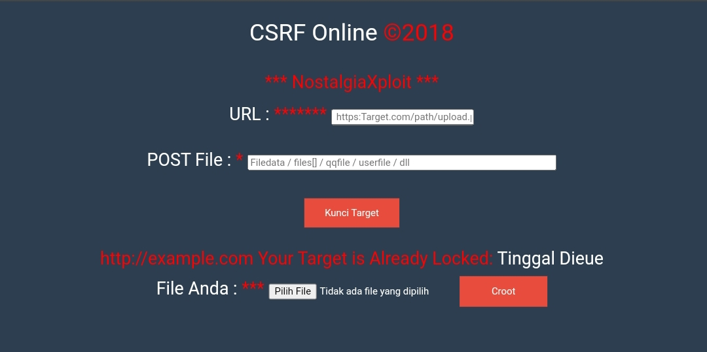

<h1>CSRF Online Tool</h1>

 
adalah alat sederhana berbasis PHP yang dirancang untuk membantu melakukan pengujian terhadap kerentanan CSRF (Cross-Site Request Forgery) pada situs web target. Alat ini memberikan antarmuka yang intuitif untuk mengirimkan file melalui metode POST ke endpoint yang ditentukan.
 
<a href="https://mainsec.blogspot.com/2018/09/download-script-csrf-online.html?m=1"><strong>Artikel</strong></a>
 
<a href="https://github.com/termux-indonesia/CSRF-Online/issues/2"><strong>Laporan Bug</strong></a>

